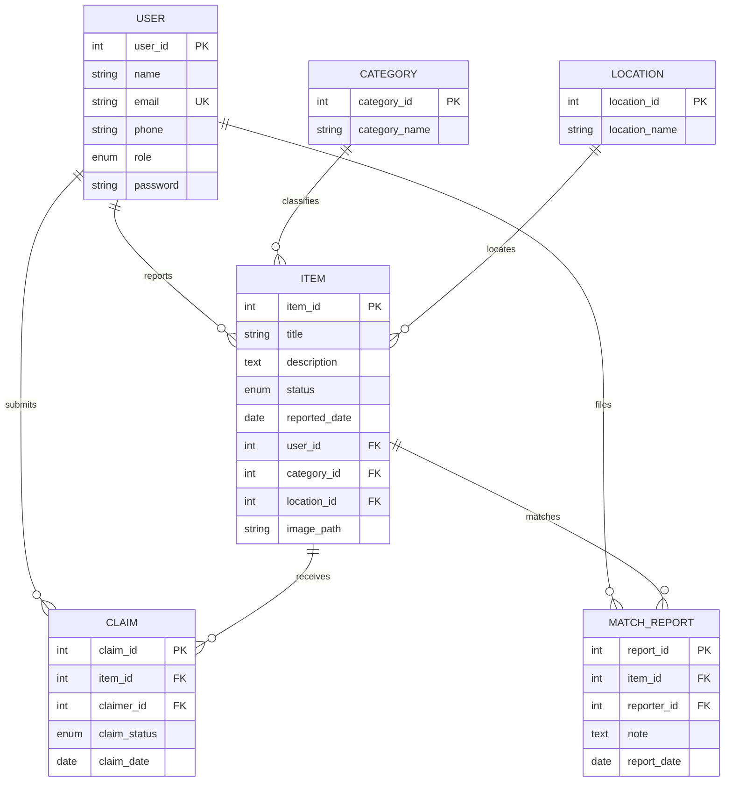

# 🗄️ Database Schema & ORM Mapping Documentation

This document provides a complete reference for the database schema used in the **Lost & Found Management System**. It covers the visual relationship layout, the complete **Prisma Schema (ORM)** models, and the original **MySQL DDL queries** (including tables, foreign key constraints, triggers, and seed data).

---

## 🗺️ Entity Relationship Layout (Overview)



---

## ⬢ Prisma Schema Code (`schema.prisma`)

Below is the complete, production-ready **Prisma ORM** mapping that represents this exact schema, complete with MySQL native types, custom enums, relations, and unique constraint definitions.

```prisma
datasource db {
  provider = "mysql"
  url      = env("DATABASE_URL")
}

generator client {
  provider = "prisma-client-js"
}

// ==========================================
// ENUMS
// ==========================================

enum Role {
  admin
  user
}

enum ItemStatus {
  lost
  found
  claimed
}

enum ClaimStatus {
  pending
  approved
  rejected
}

// ==========================================
// MODELS
// ==========================================

model User {
  user_id      Int           @id @default(autoincrement())
  name         String        @db.VarChar(100)
  email        String        @unique @db.VarChar(100)
  phone        String?       @db.VarChar(15)
  role         Role          @default(user)
  password     String        @db.VarChar(255)
  
  // Relations
  items        Item[]
  claims       Claim[]
  matchReports MatchReport[]

  @@map("USER")
}

model Category {
  category_id   Int    @id @default(autoincrement())
  category_name String @db.VarChar(100)
  
  // Relations
  items         Item[]

  @@map("CATEGORY")
}

model Location {
  location_id   Int    @id @default(autoincrement())
  location_name String @db.VarChar(100)
  
  // Relations
  items         Item[]

  @@map("LOCATION")
}

model Item {
  item_id       Int           @id @default(autoincrement())
  title         String        @db.VarChar(100)
  description   String?       @db.Text
  status        ItemStatus
  reported_date DateTime      @db.Date
  user_id       Int?
  category_id   Int?
  location_id   Int?
  image_path    String?       @db.VarChar(255)

  // Relations
  user          User?         @relation(fields: [user_id], references: [user_id], onDelete: SetNull)
  category      Category?     @relation(fields: [category_id], references: [category_id], onDelete: SetNull)
  location      Location?     @relation(fields: [location_id], references: [location_id], onDelete: SetNull)
  
  claims        Claim[]
  matchReports  MatchReport[]

  @@map("ITEM")
}

model Claim {
  claim_id     Int         @id @default(autoincrement())
  item_id      Int
  claimer_id   Int
  claim_status ClaimStatus @default(pending)
  claim_date   DateTime    @db.Date

  // Relations
  item         Item        @relation(fields: [item_id], references: [item_id], onDelete: Cascade)
  claimer      User        @relation(fields: [claimer_id], references: [user_id], onDelete: Cascade)

  // Constraints
  @@unique([item_id, claimer_id], name: "unique_item_claimer")
  @@map("CLAIM")
}

model MatchReport {
  report_id   Int      @id @default(autoincrement())
  item_id     Int
  reporter_id Int
  note        String?  @db.Text
  report_date DateTime @db.Date

  // Relations
  item        Item     @relation(fields: [item_id], references: [item_id], onDelete: Cascade)
  reporter    User     @relation(fields: [reporter_id], references: [user_id], onDelete: Cascade)

  // Constraints
  @@unique([item_id, reporter_id], name: "unique_match_reporter")
  @@map("MATCH_REPORT")
}
```

---

## 🛢️ Complete MySQL DDL & Seeding Queries

The original MySQL SQL queries used to create the schema, tables, constraints, trigger automation, and test seed records.

```sql
-- 1. Database Creation
CREATE DATABASE IF NOT EXISTS lost_and_found;
USE lost_and_found;

-- 2. User Table
CREATE TABLE IF NOT EXISTS USER (
    user_id INT PRIMARY KEY AUTO_INCREMENT,
    name VARCHAR(100) NOT NULL,
    email VARCHAR(100) UNIQUE NOT NULL,
    phone VARCHAR(15),
    role ENUM('admin', 'user') DEFAULT 'user',
    password VARCHAR(255) NOT NULL
);

-- 3. Category Table
CREATE TABLE IF NOT EXISTS CATEGORY (
    category_id INT PRIMARY KEY AUTO_INCREMENT,
    category_name VARCHAR(100) NOT NULL
);

-- 4. Location Table
CREATE TABLE IF NOT EXISTS LOCATION (
    location_id INT PRIMARY KEY AUTO_INCREMENT,
    location_name VARCHAR(100) NOT NULL
);

-- 5. Item Table
CREATE TABLE IF NOT EXISTS ITEM (
    item_id INT PRIMARY KEY AUTO_INCREMENT,
    title VARCHAR(100) NOT NULL,
    description TEXT,
    status ENUM('lost', 'found', 'claimed') NOT NULL,
    reported_date DATE NOT NULL,
    user_id INT,
    category_id INT,
    location_id INT,
    image_path VARCHAR(255) NULL,
    FOREIGN KEY (user_id) REFERENCES USER(user_id) ON DELETE SET NULL,
    FOREIGN KEY (category_id) REFERENCES CATEGORY(category_id) ON DELETE SET NULL,
    FOREIGN KEY (location_id) REFERENCES LOCATION(location_id) ON DELETE SET NULL
);

-- 6. Claim Table
CREATE TABLE IF NOT EXISTS CLAIM (
    claim_id INT PRIMARY KEY AUTO_INCREMENT,
    item_id INT,
    claimer_id INT,
    claim_status ENUM('pending', 'approved', 'rejected') DEFAULT 'pending',
    claim_date DATE NOT NULL,
    FOREIGN KEY (item_id) REFERENCES ITEM(item_id) ON DELETE CASCADE,
    FOREIGN KEY (claimer_id) REFERENCES USER(user_id) ON DELETE CASCADE,
    CONSTRAINT unique_item_claimer UNIQUE (item_id, claimer_id)
);

-- 7. Match Report Table
CREATE TABLE IF NOT EXISTS MATCH_REPORT (
    report_id INT PRIMARY KEY AUTO_INCREMENT,
    item_id INT NOT NULL,
    reporter_id INT NOT NULL,
    note TEXT,
    report_date DATE NOT NULL,
    FOREIGN KEY (item_id) REFERENCES ITEM(item_id) ON DELETE CASCADE,
    FOREIGN KEY (reporter_id) REFERENCES USER(user_id) ON DELETE CASCADE,
    CONSTRAINT unique_match_reporter UNIQUE (item_id, reporter_id)
);

-- ==========================================
-- AUTOMATION TRIGGERS
-- ==========================================

-- Trigger 1: Auto-mark item as claimed when a claim is approved
DROP TRIGGER IF EXISTS after_claim_approved;
DELIMITER //
CREATE TRIGGER after_claim_approved
AFTER UPDATE ON CLAIM
FOR EACH ROW
BEGIN
    IF NEW.claim_status = 'approved' AND (OLD.claim_status IS NULL OR OLD.claim_status <> 'approved') THEN
        UPDATE ITEM
        SET status = 'claimed'
        WHERE item_id = NEW.item_id;
    END IF;
END //
DELIMITER ;

-- Trigger 2: Auto-reject other pending claims when an item's status changes to claimed
DROP TRIGGER IF EXISTS after_item_status_claimed;
DELIMITER //
CREATE TRIGGER after_item_status_claimed
AFTER UPDATE ON ITEM
FOR EACH ROW
BEGIN
    IF NEW.status = 'claimed' AND (OLD.status IS NULL OR OLD.status <> 'claimed') THEN
        UPDATE CLAIM
        SET claim_status = 'rejected'
        WHERE item_id = NEW.item_id AND claim_status = 'pending';
    END IF;
END //
DELIMITER ;

-- ==========================================
-- TEST SEED DATA
-- ==========================================

-- Categories
INSERT IGNORE INTO CATEGORY (category_id, category_name) VALUES
(1, 'Electronics'),
(2, 'Bags'),
(3, 'Keys'),
(4, 'Clothing'),
(5, 'Documents'),
(6, 'Other');

-- Locations
INSERT IGNORE INTO LOCATION (location_id, location_name) VALUES
(1, 'Library'),
(2, 'Canteen'),
(3, 'Main Gate'),
(4, 'Parking Lot'),
(5, 'Classroom');

-- Default Seeded Users (Passwords hashed using BCrypt)
-- admin@email.com -> admin123
-- rahul@email.com -> rahul123
-- priya@email.com -> priya123
INSERT IGNORE INTO USER (user_id, name, email, phone, role, password) VALUES
(1, 'Admin User', 'admin@email.com', '9000000000', 'admin', '$2a$10$IbFT5Nsl7rdRfBieyI2O7.SaJ79Da23H6i2Cp6zispBtKTkPzs15u'),
(2, 'Rahul Kumar', 'rahul@email.com', '9876543210', 'user', '$2a$10$aMjqMmjRLrBjJppmNTNBdOZTe.4PfCWslnpzu4ZDebRUFCzDBXt0K'),
(3, 'Priya Singh', 'priya@email.com', '9123456780', 'user', '$2a$10$JuzxBe.PIXy7sYI9DEqvUO5r8eKQOpBudXXBfTks7V.H9Bad3fyVK');

-- Default Seeded Items
INSERT IGNORE INTO ITEM (item_id, title, description, status, reported_date, user_id, category_id, location_id) VALUES
(1, 'Black Backpack', 'Nike bag with laptop inside', 'lost', CURDATE(), 2, 2, 1),
(2, 'iPhone 13', 'Black colour, cracked screen', 'found', CURDATE(), 3, 1, 3),
(3, 'Car Keys', 'Honda car keys with red keychain', 'lost', CURDATE(), 2, 3, 4);

-- Default Seeded Claims
INSERT IGNORE INTO CLAIM (claim_id, item_id, claimer_id, claim_status, claim_date) VALUES
(1, 2, 2, 'pending', CURDATE());
```
